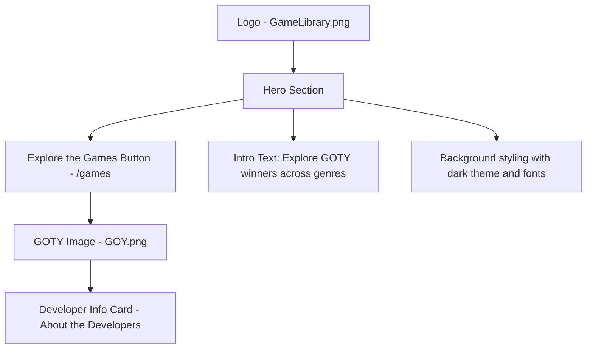
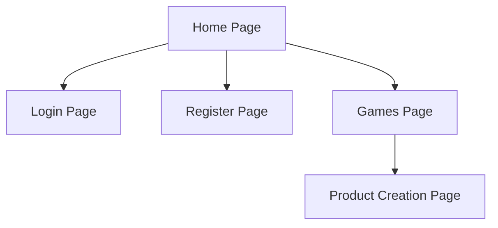

# CST-339 CLC Project – Milestone 3  
https://github.com/JIaconisGCU/CST-339_Group-5

---
---

**Carlos Cortes (Role 1): Presentation / UX Lead**

---

## Cover Page – Tasks Completed by Role 1
- Created global Thymeleaf layout (`common.html`) with Bootstrap integration.  
- Implemented responsive navbar with links to Home, Login, Register.  
- Built `home.html` page extending the layout.  
- Integrated teammates’ pages (`login.html`, `register.html`) into layout for consistent look and feel.  
- Corrected Thymeleaf namespace issues to ensure layout processing.  
- Ensured responsiveness works on desktop, tablet, and mobile (tested with Chrome DevTools).  
- Verified UI consistency after resolving merge conflicts.
- **Milestone 3 Updates**:  
  - Finalized global theme (teal + retro yellow color scheme, consistent fonts via Google Fonts).  
  - Added logo (`GameLibrary.png`) and GOTY image (`GOY.png`) to homepage.  
  - Styled homepage hero section with “Explore the Games” button.  
  - Replaced button link to `/games` instead of `/products/new`.  
  - Applied custom CSS in `app.css` for buttons, navbar, and footer.  
  - Styled navbar with dark background, teal brand, white links, and yellow hover.  
  - Added active link highlighting for current page.  
  - Fixed footer visibility with dark background and contrast improvements.    

---

## Planning Documentation (Role 1 perspective)
- **Role split**: Carlos handled Presentation/UX (common layout, Home page, navbar, responsive testing). Teammates handled Registration and Login controllers + forms.  
- **Workflow**:  
  - Each teammate developed in local branch.  
  - All code merged to `development` branch on GitHub.  
  - Merge conflicts were resolved, prioritizing:  
    - Role 1 for layout/UI code.  
    - Role 2 & 3 for Registration/Login controllers.  
- **Peer review**: teammates reviewed layout changes and tested in browsers before merging.  

---

## General Technical Approach (Update from Milestone 1)
- Used **Spring Boot 3.5.5** with **Thymeleaf** for dynamic views.  
- Added **Thymeleaf Layout Dialect** to support reusable layout (`common.html`).  
- Used **Bootstrap 5** (via CDN) for responsive design.  
- Ensured all pages (`home`, `login`, `register`) extend `common.html` for consistency.  
- **Milestone 3 Updates**
     - Introduced **Google Fonts** (`Press Start 2P` and `Roboto`) for branding.  
     - Applied **custom CSS (`app.css`)** for teal/yellow theme and footer contrast fixes.  

---

## Key Technical Design Decisions
- Chose Thymeleaf Layout Dialect instead of copy/paste headers/footers → promotes reuse and maintainability.  
- Implemented one **global navbar** with links to Home, Login, Register (to be adapted for authentication in later milestones).  
- Chose Bootstrap’s grid system for responsiveness instead of custom CSS.  
- Deleted `LoginRegisterController.java` to avoid duplicate mappings and errors, ensuring controllers map uniquely. 
- **Milestone 3 Update**
     - Created a dedicated `app.cs` to centralize color scheme, button styles, navbar, and footer.

---

## Install / Configuration Instructions (for layout work)
1. Ensure the following dependency exists in `pom.xml`:  

   ```xml
   <dependency>
       <groupId>nz.net.ultraq.thymeleaf</groupId>
       <artifactId>thymeleaf-layout-dialect</artifactId>
   </dependency>
   ```
2. Place all static assets in src/main/resources/static
     - CSS --> /css/app/css
     - Images --> /img/GameLibrary.png, /img/GOY.png
3. Run the application with mvn spring-boot:run or from your IDE.
4. Access the homepage at http://localhost:8080/ and verify:
     - Logo and GOTY images display correctly.
     - Navbar links (Home, Login, and Register) appear styled.
     - "Explore the Games" button links to /games.
     - Footer text visible against background.

## User Interface Diagrams

### Homepage Wireframe


## Sitemap Diagram


---

## Known Issues (Role 1 perspective)
- Product data and Games page are not yet implemented (planned for future milestones).  
- Images must be placed in the correct `/static/img` directory; incorrect paths may cause broken images.  
- Footer readability depends on background contrast; adjusted with dark background fix, but may need further testing on different displays.  
- Navbar active link highlighting may not always reflect correctly if new routes are added without updating `navbar.html`.  

---

# CST-339 CLC Project – Milestone 2  
**James Pinto, Role 2: Registration / User Management Lead**

---

## Cover Page – Tasks Completed by Role 2
- Created `User` model class with validation annotations (`@NotBlank`, `@Email`, `@Pattern`, `@Size`).  
- Built `RegisterController` with GET (form) and POST (process) mappings.  
- Developed `register.html` Thymeleaf form integrated with Bootstrap, including error messages.  
- Added `register-success.html` confirmation page (later redirected to `/login` for session-based login flow).  
- Implemented `InMemoryUserStore` component to temporarily store registered users until database integration.  
- Coordinated with LoginController (Role 3) to allow authentication against registered users.  
- Added draft database design for `users` table, including ER diagram, class diagram, and DDL script.  

---

## Planning Documentation (Role 2 perspective)
- **Role split**: James handled Registration/User Management, Carlos handled Presentation/UX, Justin handled Login/session management.  
- **Workflow**:  
  - Registration logic was developed in a separate feature branch (`james/registration`).  
  - Integrated with `development` branch after validation with team.  
  - Collaborated with Role 1 to ensure `register.html` used the new global layout (`common.html`).  
  - Coordinated with Role 3 so that login could use registered users from the in-memory store.  

---

## General Technical Approach (Update from Milestone 1)
- Implemented `User` model with server-side validation (email format, phone number pattern, password length).  
- Used **Thymeleaf forms** for binding and error display.  
- Added `InMemoryUserStore` as a placeholder repository for users, allowing registration/login workflow before database setup.  
- Drafted SQL DDL script for `users` table and supporting diagrams (class diagram and ER snippet).  
- Future milestones: move from in-memory store → MySQL via Spring Data JDBC with hashed passwords (BCrypt).  

---

## Key Technical Design Decisions
- Used Bean Validation (Jakarta Validation) for consistent server-side validation rules.  
- Chose an in-memory store for simplicity and to unblock login integration before DB setup.  
- Redirected successful registration to `/login` so session is managed consistently in one place.  
- Drafted DDL script with unique constraints (`username`, `email`) to enforce data integrity.  
- Created ER and class diagrams for documentation; placed them in `/docs/` folder for maintainability.  

---

## Install / Configuration Instructions (for registration work)
1. Ensure the following dependency exists in `pom.xml`:  
   ```xml
   <dependency>
       <groupId>org.springframework.boot</groupId>
       <artifactId>spring-boot-starter-validation</artifactId>
   </dependency>

---
## ER Diagram
  ```mermaid
  erDiagram
      USER ||--o{ VIDEOGAME : "created_by (future)"
      USER {
          BIGINT id PK
          VARCHAR first_name
          VARCHAR last_name
          VARCHAR email
          VARCHAR phone
          VARCHAR username
          VARCHAR password_hash
          DATETIME created_at
          DATETIME updated_at
      }
      VIDEOGAME {
          BIGINT id PK
          VARCHAR title
          VARCHAR genre
          INT year
          VARCHAR description
          BIGINT created_by FK
      }
```
#### *Figure 1* ER diagram snippet showing the users table and its future relationship to videogame entities.
---
## User Class Diagram
  ```mermaid
  classDiagram
class User {
  - firstName : String
  - lastName  : String
  - email     : String
  - phone     : String
  - username  : String
  - password  : String
  + get/set...
}
```
#### *Figure 2* UML Class Diagram of the User model showing attributes and validation rules for registration. 
---
## DDL draft - *users* table
```sql
-- Draft DDL: users (prototype; no persistence wired in this milestone)
CREATE TABLE users (
  id             BIGINT PRIMARY KEY AUTO_INCREMENT,
  first_name     VARCHAR(50)  NOT NULL,
  last_name      VARCHAR(50)  NOT NULL,
  email          VARCHAR(254) NOT NULL UNIQUE,
  phone          VARCHAR(20)  NOT NULL,
  username       VARCHAR(30)  NOT NULL UNIQUE,
  password_hash  VARCHAR(255) NOT NULL,
  created_at     TIMESTAMP DEFAULT CURRENT_TIMESTAMP,
  updated_at     TIMESTAMP DEFAULT CURRENT_TIMESTAMP ON UPDATE CURRENT_TIMESTAMP
);

CREATE INDEX idx_users_username ON users(username);
CREATE INDEX idx_users_email ON users(email);
```
#### *Figure 3* Draft SQL DDL script for the *users* table with uniqueness contraints and timestamps.
---

# CST-339 CLC Project – Milestone 2  
**Justin Iaconis, Role 3: Login Function, Repository Manager**

---

## Cover Page – Tasks Completed by Role 3
- Created project GitHub repository, with the "live" `master` branch and the `development` branch.
- Built HTML page to provide login functionality with a submission form
- Built `LoginController` class that provides mapping for the login page
- `LoginController` can set and clear the user in the HTTP session.
- Ensured the navbar updated appropriately based on if the user was logged in.
- Resolved merging conflicts in the repositry.
- Ensured the project was functional on every team members' machines after merging the `development` branch to the `master` branch.

---

## Planning Documentation (Role 3 perspective)
- **Role split**: James handled Registration and User Management, Carlos handled the webpages, layout, and fragments, and Justin handled login functionality and managed the repository.  
- **Workflow**:  
  - Developed login logic in a separate feature branch (`justin/feature/login`).  
  - Branch was pushed and merged with `development` branch after verifying readiness with other team members.  
  - Managed repository as other team members submitted their features into the `development` branch.
  - Coordinated with team members to fix any issues, such as conflicts while pushing to the repository.
  - Worked with Role 1 to ensure the navbar fragment was responding correctly to the user's login status.
  - Pulled the `development` branch's commits into the `master` branch.

---

## General Technical Approach (Update from Milestone 1)
- Used **Thymeleaf forms** for binding and error display.
- Used GitHub to maintain the project repository.

---

## Key Technical Design Decisions
- Tied login information to HTTP session's attributes
- If the user is not logged in, the session's `username` attribute will be null or empty, otherwise it will be their username.
- All attributes are cleared upon logout.

---

## Future Risks & Concerns
- Temporary hard-coded username and password verification must be replaced with a verification system integrated with the user registration and database system.


