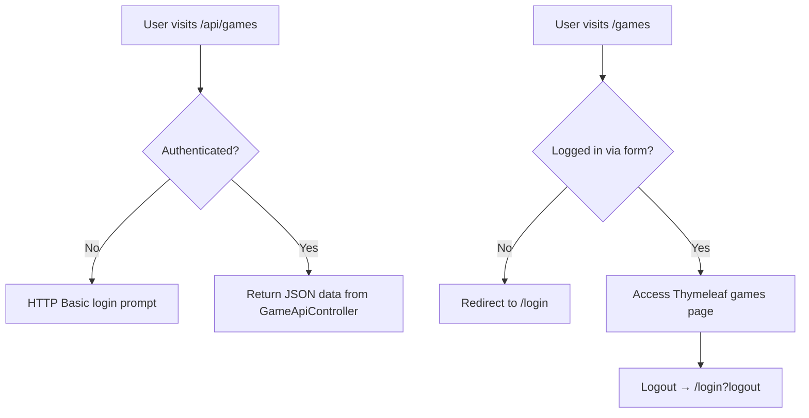

# CST-339 CLC Project – Milestone 7  
**Carlos Cortes Role 1: Presentation / UX Lead (Testing & Documentation)**  
**James Pinto Role 2: Business Logic Lead (REST API & Security Enhancements)**  

---

## Cover Page – Tasks Completed by Roles 1 & 2  
- **James Pinto (Role 2 – Business Logic Lead):**  
  - Added and tested **secured REST endpoints**:  
    - `GET /api/games` – retrieves all games.  
    - `GET /api/games/{id}` – retrieves a single game by ID.  
  - Implemented **`GameApiController`** and **`GameDTO`** for JSON responses.  
  - Updated **`SecurityConfig.java`** to require HTTP Basic authentication for all `/api/**` routes.  
  - Integrated Spring Security form login with REST Basic Auth using a unified filter chain.  
  - Seeded test user `testuser / password123` into the database for API testing.  
  - Verified successful authentication via REST clients (Postman, curl) and Thymeleaf UI login flow.  

- **Carlos Cortes (Role 1 – Presentation / UX Lead):**  
  - Pulled and tested the new secured build from the `development` branch.  
  - Troubleshot MySQL schema mismatches (`role` and `enabled` columns in `users` table).  
  - Verified BCrypt password hashing and authentication against the MySQL database.  
  - Registered a new account to confirm authentication, authorization, and data access.  
  - Tested `/api/games` endpoint using HTTP Basic authentication (browser and Postman).  
  - Authored **Milestone 7 documentation** and API/Security sections in the Design Report.  

---

## Planning Documentation (Roles 1 & 2 Perspectives)  
- **James (Role 2 – Business/Service Layer):**  
  - Built REST API endpoints and integrated Spring Security HTTP Basic protection.  
  - Created and configured DTO classes for clean JSON output.  
  - Adjusted `SecurityConfig` to handle both MVC and REST authentication.  
  - Seeded users for testing and validated API-level access control.  

- **Carlos (Role 1 – Presentation/UX):**  
  - Conducted functional testing of all secured endpoints.  
  - Validated login/registration through the UI and REST authentication workflows.  
  - Created final milestone documentation for Service API and Security Design sections.  

- **Workflow:**  
  - Role 2 implemented and tested REST functionality and HTTP Basic integration.  
  - Role 1 verified login behavior, database consistency, and documentation accuracy.  
  - Peer testing confirmed API access only works when authenticated.  

---

## General Technical Approach (Updated for Milestone 7)  
- Application continues to integrate with **MySQL** via **Spring Data JDBC**.  
- Entities (`User`, `Game`) map directly to relational tables.  
- REST endpoints now supplement Thymeleaf MVC views for data retrieval.  
- Services encapsulate all business logic and are reused by both MVC and REST controllers.  
- **Milestone 7 Update:**  
  - Implemented **HTTP Basic authentication** for `/api/**` routes.  
  - Introduced **GameApiController** for secure RESTful access.  
  - Configured dual authentication (form login for UI, Basic Auth for REST).  
  - Verified BCrypt password encoding and role-based authentication logic.  

---

## Key Technical Design Decisions  
- Chose **Spring Security Basic Auth** to secure API endpoints while retaining form-based login for UI users.  
- Introduced **DTO classes (GameDTO)** to standardize REST responses.  
- Used **BCryptPasswordEncoder** for hashing and verifying user passwords.  
- Added **roles and enabled columns** to `users` table for account management.  
- Restricted access to `/api/**` endpoints to authenticated users only.  

---

## Service API Design  

### Overview  
This milestone added a secured REST API under `/api/**`, protected by Spring Security’s HTTP Basic authentication.  
Only users with valid credentials in the `users` table can access the endpoints.

### Base URL  
`http://localhost:8080/api/games`  

### Endpoints  
| Method | Endpoint | Description | Authentication | Response |
|---------|-----------|--------------|----------------|-----------|
| GET | `/api/games` | Retrieve all games | HTTP Basic | JSON array of GameDTO objects |
| GET | `/api/games/{id}` | Retrieve one game by ID | HTTP Basic | JSON object (GameDTO) |

### Example JSON Response  
```json
[
  {
    "id": 1,
    "title": "Elden Ring",
    "genre": "Action RPG",
    "year": 2022
  }
]
```

### Example Request (curl)
curl -u testuser:password123 http://localhost:8080/api/games

## Security Design
* Form-based login for MVC routes (/login, /register).
* HTTP Basic authentication for REST API routes (/api/**).
* Custom database-backed authentication via CustomUserDetailsService.
* Passwords stored securely using BCryptPasswordEncoder.
* Users must have enabled = 1 and valid roles (ROLE_USER or ROLE_ADMIN).

## Example of Security Configuration (from SecurityConfig.java)
```http
  .authorizeHttpRequests(auth -> auth
    .requestMatchers("/login", "/register", "/error", "/css/**", "/images/**").permitAll()
    .requestMatchers("/api/**").authenticated()
    .anyRequest().authenticated()
  )
  .httpBasic()
  .formLogin(form -> form
    .loginPage("/login")
    .defaultSuccessUrl("/games", true)
    .failureUrl("/login?error")
    .permitAll()
  )
  .logout(logout -> logout.logoutSuccessUrl("/login?logout").permitAll());
```

### Install / Configuration Instructions (Milestone 7)
1. Start MAMP and ensure MySQL is running on port 8889.
2. Create a new database named videogamesdb.
3. Confirm the users table includes these columns:
id, first_name, last_name, email, phone, username, password, role, enabled.
4. Run the project with:mvn spring-boot:run
5. Access:
* Login page → http://localhost:8080/login
* API endpoint → http://localhost:8080/api/games
6. Log in with either:
* A registered user created through the app, or
* The seeded test account: testuser / password123.

### User Interface Diagram (Secured REST and Login Flow)


## Team Planning Summary

| User Story | Team Member | Hours Worked | Hours Remaining |
|-------------|--------------|---------------|----------------|
| Implement secured REST API endpoints (GET /api/games) | James Pinto | 5 | 0 |
| Test authentication and fix DB schema (role, enabled columns) | Carlos Cortes | 1.5 | 0 |
| Document security and API design in Markdown report | Carlos Cortes | 2 | 0 |
