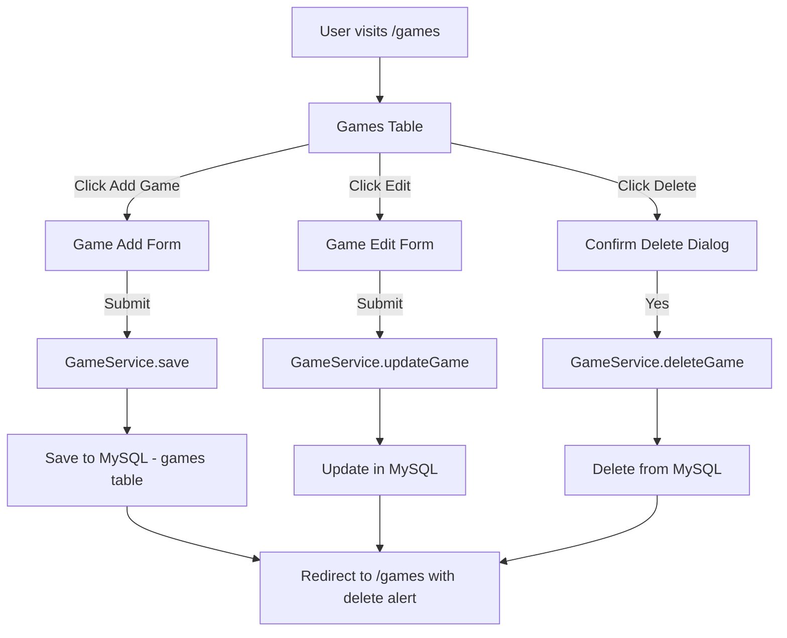
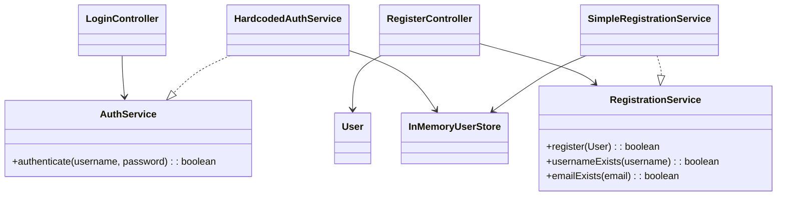

# CST-339 CLC Project – Milestone 5 
**Carlos Cortes Role 1: Presentation / UX Lead (assisting with Persistence Layer this Milestone)**

---

## Cover Page – Tasks Completed by Role 1
- Refactored **User module** (Login + Registration) to use **Spring Data JDBC** instead of in-memory services.  
- Added **`UserRepository`** (CrudRepository) and **`UserService`** for persistence.  
- Updated **`RegisterController`** and **`LoginController`** to use the new service.  
- Created and verified **`schema.sql`** for automatic table creation (`users` table).  
- Created **`data.sql`** with a safe test user for login validation.  
- Configured **`application.properties`** to connect to MySQL (`videogamesdb` on port 8889).  
- Fixed login redirect issue (now routes to `/` instead of `/home`).  
- Tested end-to-end: user registration saves to DB and login authenticates correctly.  
- **Milestone 5 Additions:**  
  - Expanded `games.html` to display games in a styled Bootstrap table with **Edit/Delete** buttons.  
  - Created new `game-edit-form.html` for updating existing games.  
  - Updated **GameAddController** with new methods for edit, update, and delete.  
  - Styled all buttons consistently (`btn-teal` for main actions, `btn-danger` for delete, `btn-secondary` for cancel).  
  - Verified full CRUD cycle: add → list → edit → update → delete.   

---

## Planning Documentation (Role 1 perspective)
- **Carlos (Role 1 – Presentation/UX, assisting Persistence)**  
  - Refactored **User module** to Spring Data JDBC  
  - Created `UserRepository` and `UserService`  
  - Updated controllers for DB  
  - Added and tested `schema.sql` and `data.sql` (users table)  
  - Fixed login redirect  
  - **Milestone 5**: Expanded `games.html`, created `game-edit-form.html`, styled buttons, and verified CRUD cycle  

- **Teammate A (Role 2 – Business/Service Layer)**  
  - Refactored **Product Creation module** to Spring Data JDBC  
  - Created `Game` entity, `GameRepository`, and `GameService`  
  - Updated `GameAddController` to save new products  
  - Extended `schema.sql` with `games` table  
  - Added sample game row in `data.sql`  
  - **Milestone 5**: Added `getGameById`, `updateGame`, and `deleteGame` in `GameService`  

- **Teammate B (Role 3 – Database/Documentation)**  
  - Finalized `schema.sql` (users + games)  
  - Added safe insert test data in `data.sql`  
  - Created/updated **ER Diagram** (users + games)  
  - Provided **DDL scripts**  
  - Helped update Design Report (technical decisions, risks, diagrams)  
  - **Milestone 5**: Confirmed DB supports update/delete, updated design report with new wireframes  

- **Workflow**:  
  - Each teammate developed in local branch.  
  - All code merged to `development` branch on GitHub.  
  - Merge conflicts were resolved, prioritizing:  
    - Role 1 for layout/UI code.  
    - Role 2 & 3 for Registration/Login controllers. 

- **Peer review**: teammates reviewed layout changes and tested in browsers before merging.  

---

## General Technical Approach (Updated from Milestones 1–5)
- Application integrates with **MySQL** via **Spring Data JDBC**.  
- Entities (`User`, `Game`) annotated with `@Table` and `@Id`.  
- Repositories extend `CrudRepository` for CRUD operations.  
- Services (`UserService`, `GameService`) encapsulate business logic.  
- `schema.sql` and `data.sql` initialize database schema and test data.  
- **Milestone 4 Update**: Refactored Login/Registration for persistence.  
- **Milestone 5 Update**:  
  - Added **Display module** (`games.html` now lists all games in a Bootstrap table).  
  - Added **Update/Delete modules** (`game-edit-form.html`, controller and service methods for edit/update/delete).  
  - Verified end-to-end CRUD: add, view, edit, update, delete. 

---

## Key Technical Design Decisions
- Chose **Spring Data JDBC** for simplified persistence.  
- Removed in-memory services to avoid confusion.  
- Used safe `IF NOT EXISTS` in `schema.sql` to prevent errors.  
- Added safe inserts in `data.sql` to avoid duplicate rows.  
- Standardized button styling with **custom `btn-teal` class** for primary actions.  
- Ensured **confirmation dialog** for delete to reduce accidental removals.  

---

## Install / Configuration Instructions (Games module additions)
1. Ensure `GameRepository` extends `CrudRepository<Game, Long>`.  
2. Confirm `schema.sql` contains:  
   ```sql
   CREATE TABLE IF NOT EXISTS games (
       id BIGINT AUTO_INCREMENT PRIMARY KEY,
       title VARCHAR(100) NOT NULL,
       genre VARCHAR(50),
       award VARCHAR(100),
       developer VARCHAR(100) NOT NULL,
       publisher VARCHAR(100) NOT NULL,
       release_date DATE NOT NULL,
       description TEXT,
       created_by_user_id BIGINT
   );


## User Interface Diagram (Games CRUD Flow)




# CST-339 CLC Project — Milestone 3
**Project:** Video Game Library (Spring Boot, Thymeleaf)  
**Role 2:** Business Logic Lead — Login & Registration (Dependency Injection)  
**Student:** James Pinto  
**Course:** CST-339 — Enterprise Applications Programming in Java  
**Team:** Group 5 (CLC)  
**Date:** September 07, 2025

---

## Cover Page: Tasks Completed (Business Logic Lead)
- Refactored Login and Registration flows to use Spring Beans & constructor-based DI.
- Introduced `AuthService` and `RegistrationService` interfaces with simple in-memory implementations.
- Integrated `InMemoryUserStore` as temporary persistence seam (Week 3: no DB required).
- Added Jakarta Validation to `User`; surfaced field/global errors in Thymeleaf templates.
- Switched to absolute routes: `GET/POST /login` and `GET /logout` for simpler navbar linking.
- Implemented session-based login state; logout clears session and redirects to `/login`.
- Updated navbar to toggle Login/Register vs. user dropdown + Logout based on session.
- Added success/error alerts to login page; page titles injected for layout.

---

## Planning Documentation

### User Story & Acceptance Criteria
- **User Story:** As a visitor, I can register an account so that I can log in to the app.  
- **User Story:** As a user, I can log in with my username and password so I can access app features.  
- **Acceptance Criteria:**
  - Validation errors display under fields.
  - Bad credentials show a global error.
  - Successful registration redirects to `/login` (or shows success message).
  - Successful login redirects to `/` with a flash message.
  - Logout clears session.

### Task List (Week 3 scope)
1. Define service interfaces (`AuthService`, `RegistrationService`).
2. Provide simple implementations backed by `InMemoryUserStore`.
3. Refactor `LoginController` and `RegisterController` to use DI (constructor injection).
4. Add Jakarta Validation to `User` and wire Thymeleaf error rendering.
5. Adjust routes to absolute paths; update navbar and messages.

---

## Design Documentation

### General Technical Approach
- **Presentation:** Thymeleaf with Bootstrap using a common layout; session-aware navbar and page titles.
- **Business Layer:** Authentication and registration behind interfaces (`AuthService`, `RegistrationService`), injected into controllers via constructor DI (Spring Core).
- **Persistence (Week 3):** `InMemoryUserStore` emulates a data source; actual DB integration is planned for Milestone 4.
- **Security (Week 3):** `HttpSession` attribute (`username`) marks logged-in state; `GET /logout` clears the session. Spring Security and password hashing are planned for later milestones.

### Key Technical Decisions
- **Constructor Injection** preferred over field injection for testability and immutability.
- **Interface-first Services** so controllers remain unchanged when swapping in DB-backed implementations.
- **Server-side Validation** with Jakarta Validation on `User`; clean Thymeleaf error surfacing.
- **Absolute Routes** (`/login`, `/logout`, `/register`) to simplify links and avoid prefix pitfalls.
- **Plain-text Passwords (Dev only)** for Week 3; hashing to be added with DB + Spring Security.

### Install / Configuration Instructions
1. Clone the repository
2. Run: `mvn spring-boot:run`
3. Open: `http://localhost:8080/`
4. Demo: Register a new user, then log in; or use a seeded account if present (e.g., `admin / Password`).
5. Logout via the navbar dropdown (`GET /logout`).

### Known Issues & Risks (Week 3)
- Passwords stored in memory and transmitted in plain text (development only).
- No authorization rules beyond basic session check; Spring Security deferred.
- In-memory data resets on application restart.
- No CSRF handling yet (using `GET /logout` for simplicity in Week 3).

### Sitemap Diagram (Week 3 scope)
```
/
├── GET /login (form), POST /login (authenticate)
├── GET /logout (clear session → redirect /login)
└── GET /register (form), POST /register (validate + save → redirect /login?registered=1)
```

### UI Diagrams (Wireframe Notes)
- **Login:** Title, success banner after registration, global error for bad creds, username/password fields, submit button.
- **Register:** First/Last/Email/Phone/Username/Password fields; field-level errors; success redirects to login.
- **Navbar:** Shows Login/Register when logged out; shows “Welcome, {username}” dropdown (Games, Logout) when logged in.

### ER Diagram & DDL Scripts
Week 3 does not require a database implementation. The Data/Domain Lead will provide a draft ERD and DDL for the Product model for Milestone 4.

### Class Diagrams (Controllers & Object Models)


---

## Review and Documentation

### Peer Code Review Notes
- Verified constructor DI (no field injection).
- Confirmed services behind interfaces; controllers have no direct `new` of service implementations.
- Checked validation annotations and Thymeleaf error rendering.
- Confirmed absolute routing and navbar session toggling work.
- Minor nit: added `StringTrimmerEditor` `@InitBinder` for cleaner validation.

### Javadoc & Inline Comments
Key classes and methods include Javadoc summaries and parameter/return tags where appropriate. Controllers outline GET/POST flows; services specify contract behavior; `InMemoryUserStore` documents expected case-insensitive lookups.

---

## Screencast & Repository

### Screencast URL
> _[Add our screencast link here]_

---

## Test Plan (Excerpt)
1. **Login / required:** Submitting empty form shows “Username and password are required.”
2. **Login / invalid:** Wrong password shows global “Invalid username or password.”
3. **Login / success:** Valid credentials redirect to `/`, shows flash “Welcome, {username}”.
4. **Register / validation:** Invalid email or short password surfaces field errors.
5. **Register / duplicates:** Existing username/email shows field errors.
6. **Register / success:** New user saved in memory; redirect to `/login?registered=1` shows success banner.
7. **Logout:** Clicking Logout clears session and redirects to `/login` with flash message.

---

## Appendix

### Key Routes
- `/login` (GET, POST), `/logout` (GET), `/register` (GET, POST)

### Key Classes (Business Logic Lead)
- `LoginController`, `RegisterController`
- `AuthService`, `RegistrationService`, `HardcodedAuthService`, `SimpleRegistrationService`
- `InMemoryUserStore`, `User`

---
---

# CST-339 CLC Project – Milestone 3  
**Justin Iaconis, Role 3: Data/Domain Lead, Repository Manager**

---

## Cover Page – Tasks Completed by Role 3
- Refactored login logic to use a record object to manage the login request
- Refactored code to extract interfaces to generalize functionality
- Designed a container object for a 'product' page for video game library entries
- Designed an HTML webpage with a form to allow users to design and instantiate Game container objects
- Integrated Boostrap & Thymeleaf into aformentioned webpage to allow posting of said container objects

---

## Planning Documentation (Role 3 perspective)
- **Role split**: Carlos was the UI Lead, James was the Business Logic Lead, and Justin as the Data Lead.  
- **Workflow**:  
  - Developed in a separate feature branch.
  - Reworked the login logic to implement the `LoginRequest.java` record
  - Generalized functionality by pulling the `IAuthenticatorService` interface from `HardcodedAuthService`
  - Generalized functionality by pulling the `IUserStore` interface from `InMemoryUserStore`
  - Generalized functionality by pulling the `IRegistrationService` interface from `SimpleRegistrationService`
  - Designed the `Game.java` container class
  - Designed the `game-add-form.html` template
  - Designed the `GameAddController.java` class to integrate the previous two developments together
  - Feature branch was pushed and merged with `development` branch after verifying readiness with other team members.
  - Pulled the `development` branch's commits into the `master` branch, handling any errors.

---

## General Technical Approach
- Used Thymeleaf forms for binding and error display, and service and component injection
- Used GitHub to maintain the project repository
- Used Jakarta for form validation

---

## Key Technical Design Decisions
- Login information is still tied to the HTTP session's attributes
  - If the user is not logged in, the session's `username` attribute will be null or empty, otherwise it will be their username.
- A `LoginRequest` record object can be used to store indeterminant data beyond what is expected or required by any one function
  - For example, a "time of request" field can be added to the record object easily
- Extracting the interfaces allows their methodology to be updated or replaced without any issues from tight coupling
  - This will be especially important when databases and encryption methods are implemented

---

## Future Risks & Concerns
- When databases are implemented and the hardcoded services and components (such as authentication and user storage) are replaced, the new database-based methods should have the `@Primary` annotation
  - The old methods should have `@Qualifier` annotations that let them be used in specific circumstances, like testing
- When submitting a game via the form page, the browser should be redirected to that new entry in the library (once the library container is implemented)


