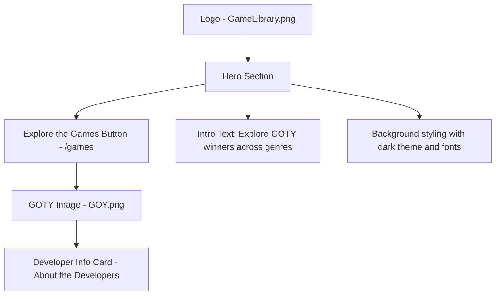
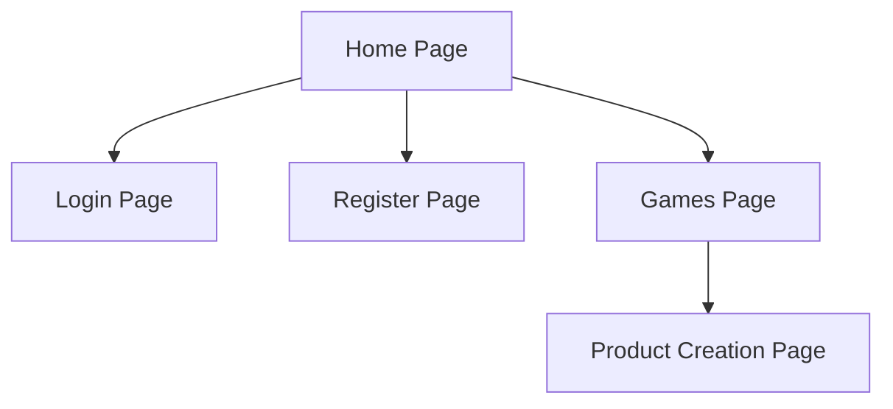
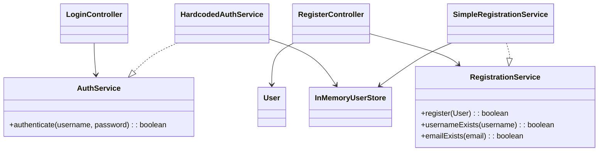

# CST-339 CLC Project – Milestone 3  
https://github.com/JIaconisGCU/CST-339_Group-5

---
---

**Carlos Cortes (Role 1): Presentation / UX Lead**

---

## Cover Page – Tasks Completed by Role 1
- Created global Thymeleaf layout (`common.html`) with Bootstrap integration.  
- Implemented responsive navbar with links to Home, Login, Register.  
- Built `home.html` page extending the layout.  
- Integrated teammates’ pages (`login.html`, `register.html`) into layout for consistent look and feel.  
- Corrected Thymeleaf namespace issues to ensure layout processing.  
- Ensured responsiveness works on desktop, tablet, and mobile (tested with Chrome DevTools).  
- Verified UI consistency after resolving merge conflicts.
- **Milestone 3 Updates**:  
  - Finalized global theme (teal + retro yellow color scheme, consistent fonts via Google Fonts).  
  - Added logo (`GameLibrary.png`) and GOTY image (`GOY.png`) to homepage.  
  - Styled homepage hero section with “Explore the Games” button.  
  - Replaced button link to `/games` instead of `/products/new`.  
  - Applied custom CSS in `app.css` for buttons, navbar, and footer.  
  - Styled navbar with dark background, teal brand, white links, and yellow hover.  
  - Added active link highlighting for current page.  
  - Fixed footer visibility with dark background and contrast improvements.    

---

## Planning Documentation (Role 1 perspective)
- **Role split**: Carlos handled Presentation/UX (common layout, Home page, navbar, responsive testing). Teammates handled Registration and Login controllers + forms.  
- **Workflow**:  
  - Each teammate developed in local branch.  
  - All code merged to `development` branch on GitHub.  
  - Merge conflicts were resolved, prioritizing:  
    - Role 1 for layout/UI code.  
    - Role 2 & 3 for Registration/Login controllers.  
- **Peer review**: teammates reviewed layout changes and tested in browsers before merging.  

---

## General Technical Approach (Update from Milestone 1)
- Used **Spring Boot 3.5.5** with **Thymeleaf** for dynamic views.  
- Added **Thymeleaf Layout Dialect** to support reusable layout (`common.html`).  
- Used **Bootstrap 5** (via CDN) for responsive design.  
- Ensured all pages (`home`, `login`, `register`) extend `common.html` for consistency.  
- **Milestone 3 Updates**
     - Introduced **Google Fonts** (`Press Start 2P` and `Roboto`) for branding.  
     - Applied **custom CSS (`app.css`)** for teal/yellow theme and footer contrast fixes.  

---

## Key Technical Design Decisions
- Chose Thymeleaf Layout Dialect instead of copy/paste headers/footers → promotes reuse and maintainability.  
- Implemented one **global navbar** with links to Home, Login, Register (to be adapted for authentication in later milestones).  
- Chose Bootstrap’s grid system for responsiveness instead of custom CSS.  
- Deleted `LoginRegisterController.java` to avoid duplicate mappings and errors, ensuring controllers map uniquely. 
- **Milestone 3 Update**
     - Created a dedicated `app.cs` to centralize color scheme, button styles, navbar, and footer.

---

## Install / Configuration Instructions (for layout work)
1. Ensure the following dependency exists in `pom.xml`:  

   ```xml
   <dependency>
       <groupId>nz.net.ultraq.thymeleaf</groupId>
       <artifactId>thymeleaf-layout-dialect</artifactId>
   </dependency>
   ```
2. Place all static assets in src/main/resources/static
     - CSS --> /css/app/css
     - Images --> /img/GameLibrary.png, /img/GOY.png
3. Run the application with mvn spring-boot:run or from your IDE.
4. Access the homepage at http://localhost:8080/ and verify:
     - Logo and GOTY images display correctly.
     - Navbar links (Home, Login, and Register) appear styled.
     - "Explore the Games" button links to /games.
     - Footer text visible against background.

## User Interface Diagrams

### Homepage Wireframe


## Sitemap Diagram


---

## Known Issues (Role 1 perspective)
- Product data and Games page are not yet implemented (planned for future milestones).  
- Images must be placed in the correct `/static/img` directory; incorrect paths may cause broken images.  
- Footer readability depends on background contrast; adjusted with dark background fix, but may need further testing on different displays.  
- Navbar active link highlighting may not always reflect correctly if new routes are added without updating `navbar.html`.  

---

# CST-339 CLC Project — Milestone 3
**Project:** Video Game Library (Spring Boot, Thymeleaf)  
**Role 2:** Business Logic Lead — Login & Registration (Dependency Injection)  
**Student:** James Pinto  
**Course:** CST-339 — Enterprise Applications Programming in Java  
**Team:** Group 5 (CLC)  
**Date:** September 07, 2025

---

## Cover Page: Tasks Completed (Business Logic Lead)
- Refactored Login and Registration flows to use Spring Beans & constructor-based DI.
- Introduced `AuthService` and `RegistrationService` interfaces with simple in-memory implementations.
- Integrated `InMemoryUserStore` as temporary persistence seam (Week 3: no DB required).
- Added Jakarta Validation to `User`; surfaced field/global errors in Thymeleaf templates.
- Switched to absolute routes: `GET/POST /login` and `GET /logout` for simpler navbar linking.
- Implemented session-based login state; logout clears session and redirects to `/login`.
- Updated navbar to toggle Login/Register vs. user dropdown + Logout based on session.
- Added success/error alerts to login page; page titles injected for layout.

---

## Planning Documentation

### User Story & Acceptance Criteria
- **User Story:** As a visitor, I can register an account so that I can log in to the app.  
- **User Story:** As a user, I can log in with my username and password so I can access app features.  
- **Acceptance Criteria:**
  - Validation errors display under fields.
  - Bad credentials show a global error.
  - Successful registration redirects to `/login` (or shows success message).
  - Successful login redirects to `/` with a flash message.
  - Logout clears session.

### Task List (Week 3 scope)
1. Define service interfaces (`AuthService`, `RegistrationService`).
2. Provide simple implementations backed by `InMemoryUserStore`.
3. Refactor `LoginController` and `RegisterController` to use DI (constructor injection).
4. Add Jakarta Validation to `User` and wire Thymeleaf error rendering.
5. Adjust routes to absolute paths; update navbar and messages.

---

## Design Documentation

### General Technical Approach
- **Presentation:** Thymeleaf with Bootstrap using a common layout; session-aware navbar and page titles.
- **Business Layer:** Authentication and registration behind interfaces (`AuthService`, `RegistrationService`), injected into controllers via constructor DI (Spring Core).
- **Persistence (Week 3):** `InMemoryUserStore` emulates a data source; actual DB integration is planned for Milestone 4.
- **Security (Week 3):** `HttpSession` attribute (`username`) marks logged-in state; `GET /logout` clears the session. Spring Security and password hashing are planned for later milestones.

### Key Technical Decisions
- **Constructor Injection** preferred over field injection for testability and immutability.
- **Interface-first Services** so controllers remain unchanged when swapping in DB-backed implementations.
- **Server-side Validation** with Jakarta Validation on `User`; clean Thymeleaf error surfacing.
- **Absolute Routes** (`/login`, `/logout`, `/register`) to simplify links and avoid prefix pitfalls.
- **Plain-text Passwords (Dev only)** for Week 3; hashing to be added with DB + Spring Security.

### Install / Configuration Instructions
1. Clone the repository
2. Run: `mvn spring-boot:run`
3. Open: `http://localhost:8080/`
4. Demo: Register a new user, then log in; or use a seeded account if present (e.g., `admin / Password`).
5. Logout via the navbar dropdown (`GET /logout`).

### Known Issues & Risks (Week 3)
- Passwords stored in memory and transmitted in plain text (development only).
- No authorization rules beyond basic session check; Spring Security deferred.
- In-memory data resets on application restart.
- No CSRF handling yet (using `GET /logout` for simplicity in Week 3).

### Sitemap Diagram (Week 3 scope)
```
/
├── GET /login (form), POST /login (authenticate)
├── GET /logout (clear session → redirect /login)
└── GET /register (form), POST /register (validate + save → redirect /login?registered=1)
```

### UI Diagrams (Wireframe Notes)
- **Login:** Title, success banner after registration, global error for bad creds, username/password fields, submit button.
- **Register:** First/Last/Email/Phone/Username/Password fields; field-level errors; success redirects to login.
- **Navbar:** Shows Login/Register when logged out; shows “Welcome, {username}” dropdown (Games, Logout) when logged in.

### ER Diagram & DDL Scripts
Week 3 does not require a database implementation. The Data/Domain Lead will provide a draft ERD and DDL for the Product model for Milestone 4.

### Class Diagrams (Controllers & Object Models)


---

## Review and Documentation

### Peer Code Review Notes
- Verified constructor DI (no field injection).
- Confirmed services behind interfaces; controllers have no direct `new` of service implementations.
- Checked validation annotations and Thymeleaf error rendering.
- Confirmed absolute routing and navbar session toggling work.
- Minor nit: added `StringTrimmerEditor` `@InitBinder` for cleaner validation.

### Javadoc & Inline Comments
Key classes and methods include Javadoc summaries and parameter/return tags where appropriate. Controllers outline GET/POST flows; services specify contract behavior; `InMemoryUserStore` documents expected case-insensitive lookups.

---

## Screencast & Repository

### Screencast URL
> _[Add our screencast link here]_

---

## Test Plan (Excerpt)
1. **Login / required:** Submitting empty form shows “Username and password are required.”
2. **Login / invalid:** Wrong password shows global “Invalid username or password.”
3. **Login / success:** Valid credentials redirect to `/`, shows flash “Welcome, {username}”.
4. **Register / validation:** Invalid email or short password surfaces field errors.
5. **Register / duplicates:** Existing username/email shows field errors.
6. **Register / success:** New user saved in memory; redirect to `/login?registered=1` shows success banner.
7. **Logout:** Clicking Logout clears session and redirects to `/login` with flash message.

---

## Appendix

### Key Routes
- `/login` (GET, POST), `/logout` (GET), `/register` (GET, POST)

### Key Classes (Business Logic Lead)
- `LoginController`, `RegisterController`
- `AuthService`, `RegistrationService`, `HardcodedAuthService`, `SimpleRegistrationService`
- `InMemoryUserStore`, `User`

---
---

# CST-339 CLC Project – Milestone 2  
**Justin Iaconis, Role 3: Login Function, Repository Manager**

---

## Cover Page – Tasks Completed by Role 3
- Created project GitHub repository, with the "live" `master` branch and the `development` branch.
- Built HTML page to provide login functionality with a submission form
- Built `LoginController` class that provides mapping for the login page
- `LoginController` can set and clear the user in the HTTP session.
- Ensured the navbar updated appropriately based on if the user was logged in.
- Resolved merging conflicts in the repositry.
- Ensured the project was functional on every team members' machines after merging the `development` branch to the `master` branch.

---

## Planning Documentation (Role 3 perspective)
- **Role split**: James handled Registration and User Management, Carlos handled the webpages, layout, and fragments, and Justin handled login functionality and managed the repository.  
- **Workflow**:  
  - Developed login logic in a separate feature branch (`justin/feature/login`).  
  - Branch was pushed and merged with `development` branch after verifying readiness with other team members.  
  - Managed repository as other team members submitted their features into the `development` branch.
  - Coordinated with team members to fix any issues, such as conflicts while pushing to the repository.
  - Worked with Role 1 to ensure the navbar fragment was responding correctly to the user's login status.
  - Pulled the `development` branch's commits into the `master` branch.

---

## General Technical Approach (Update from Milestone 1)
- Used **Thymeleaf forms** for binding and error display.
- Used GitHub to maintain the project repository.

---

## Key Technical Design Decisions
- Tied login information to HTTP session's attributes
- If the user is not logged in, the session's `username` attribute will be null or empty, otherwise it will be their username.
- All attributes are cleared upon logout.

---

## Future Risks & Concerns
- Temporary hard-coded username and password verification must be replaced with a verification system integrated with the user registration and database system.


