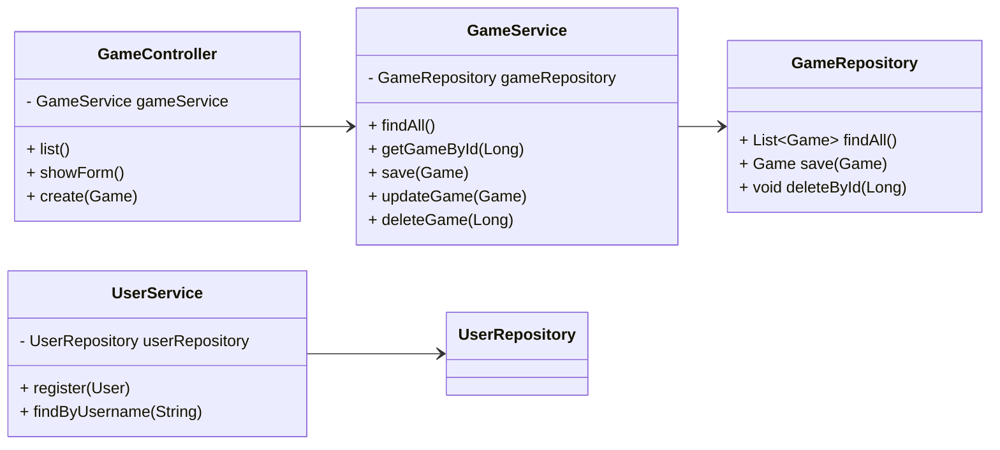

# Video Game Library Catalog – CST-339 Final Project

**By:** Carlos Cortes & James Pinto  
**Course:** CST-339 Programming in Java III  
**Framework:** Spring Boot, Thymeleaf, MySQL

---

## Introduction
- **Project Title:** Video Game Library Catalog  
- **Purpose:** A full-stack web app that tracks *Game of the Year* winners by genre.
- **Architecture:** N-Layer Model (Presentation → Business → Persistence)  
- **Technologies:**  
  - Spring MVC – Presentation Layer  
  - Spring Core – Business Logic  
  - Spring Data JDBC – Persistence  
  - MySQL – Database  
  - Bootstrap – Responsive UI

**Figure 1.** N-Layer Architecture Diagram

---

## Milestone 1 – Project Proposal & Planning (Carlos)
- Defined application concept and user roles.
- Created sitemap and early wireframes.
- Set up GitHub repository.
- Assigned tasks:  
  - **Carlos:** Front-End & UI/UX  
  - **James:** Back-End & Security

**Figure 2.** Sitemap Diagram (Home → Games → Login → Register)

---

## Milestone 2 – Application Layout (Carlos)
- Implemented **MVC** structure with Thymeleaf templates.
- Built `home.html`, `login.html`, and `register.html` pages.
- Styled interface using Bootstrap.
- Added reusable Thymeleaf fragments (navbar, footer, layout).

**Figure 3.** Screenshot of Home Page

---

## Milestone 3 – Product Creation Module (Carlos)
- Developed the *Add Game* form (first CRUD feature).
- Introduced Spring Beans and IoC for dependency management.
- Prepared the application for database integration.

**Code Example:**
```java
@GetMapping("/games/add")
public String addGameForm(Model model) {
    model.addAttribute("game", new Game());
    return "game-add-form";
}
```
**Figure 4.** Screenshot of “Add Game” Form

---

## 🗄️ Database Setup (Preview)
- Designed MySQL tables for `users` and `games`.
- Created ER Diagram for database relationships.
- Prepared SQL schema and seed data.

**Schema Example:**
```
users(id, username, password, role)
games(id, title, genre, year, winner)
```
**Figure 5.** ER Diagram

---

## UI Basics & Design (Carlos)
- Applied Bootstrap grid system for responsive layout.
- Chose teak and black color theme for modern look.
- Fonts: *Press Start 2P* & *Roboto*.
- Used modular Thymeleaf fragments for reusability.

**Figure 6.** Screenshot of Full Page with Navbar & Footer

---

## Milestone 4 – CRUD Functionality (James)
- Implemented `GameController` and `GameService`.
- Developed full Create, Read, Update, Delete workflow.
- Added validation for `title` and `year` fields.
- Tested CRUD flow through browser and verified database persistence.

**Code Snippet:**
```java
@PostMapping("/games/add")
public String addGame(@ModelAttribute Game game) {
    gameService.addGame(game);
    return "redirect:/games";
}
```
**Visuals:**
1. Game List page with “Add Game” button.  
2. Add Game form submission.  
3. Updated table with new entry.

1. **Add Game Form**  
   

2. **Game List (Updated)**  
   

3. **Add New Game Code**  
   

>*"We implemented the CRUD functionality with a layered approach, controller, service, and repository. Each operation was tested through the browser and verified in the database. Each controller method calls the service, which interacts with the repository to update MySQL. Using dependency injection made our code modular and testable. Validation ensures data quality, if fields are missing, the form returns with an error message instead of submitting.
"*

---

## Milestone 5 – Security Implementation (James)
- Configured **Spring Security** for authentication.
- Created custom login and logout pages.
- Protected CRUD routes for authenticated users.
- Encrypted passwords using BCrypt.

**Code Snippet:**
```java
@Override
protected void configure(HttpSecurity http) throws Exception {
    http.authorizeRequests()
        .requestMatchers("/games/**").authenticated()
        .anyRequest().permitAll()
        .and()
        .formLogin().loginPage("/login").permitAll()
        .and()
        .logout().permitAll();
}
```
**Visuals:**
- Login page with alerts (error/success/logout).  
- Unauthorized redirect example.  
- MySQL table with encrypted passwords.

1. **Login Authentication Error Message**  
   

2. **Security filter chain**  
   

3. **DB Table Showing Password BCrypt**  
   

>*"To protect data, we implemented Spring Security with form-based login and BCrypt password encoding. Unauthenticated users are redirected to the login page when trying to access /games. This ensures that only registered users can manage game data. We tested both valid and invalid login flows to confirm correct redirection and session management.
"*

---

## Milestone 6 – Testing, OOP & UML (James)
**Testing:**
- Validated all CRUD operations and database updates.  
- Performed manual and browser-based integration tests.  
- Tested security access by attempting restricted URLs.

**OOP Principles:**
- **Encapsulation:** Private entity fields with controlled access.  
- **Abstraction:** Logic separated into layers (Controller → Service → Repository).  
- **Polymorphism:** Interfaces for repository injection (`GameRepository`, `UserRepository`).

**Speaking Script:**
> During Milestone 6, I focused on testing and refining our object-oriented design. We confirmed that CRUD, security, and repository connections worked end-to-end. The UML diagram shows how our controllers depend on services, and services depend on repositories. This modular architecture makes our code testable, maintainable, and scalable.

**UML Diagram:**

>*"For testing, we validated each layer of the architecture (controllers, services, and repositories) by performing both browser-based CRUD tests and manual data checks directly in MySQL. Each create, edit, and delete operation was confirmed through the interface and verified in the database. We also tested our security layer by attempting to access restricted URLs while logged out, ensuring that Spring Security correctly redirected to the login page. From an object-oriented perspective, we applied several key principles. Encapsulation keeps each entity’s data private, using getters and setters only where needed. Abstraction separates logic into distinct layers, controllers handle web requests, services process business logic, and repositories manage data access. Polymorphism is achieved through interfaces like GameRepository and UserRepository, allowing our services to call the same method names on different implementations if needed. The UML diagram on this slide visualizes these relationships. You can see how controllers depend on services, which in turn depend on repositories. Our GameService acts as the main business hub, connecting the presentation layer with the persistence layer, while UserService and CustomUserDetailsService support authentication. This structure makes our code modular, testable, and easier to maintain as new features are added later in the project.
"*

**UML Diagram**  
   
---

## 🧩 Milestone 7 – Demo & Improvements (James)
- Demonstrated full user journey:  
  **Register → Login → Manage Games → Logout**  
- Confirmed success messages, redirects, and database updates.

**Future Enhancements:**
- Add search and filtering.  
- Paginate large game lists.  
- Build REST API for external access.

**Visuals:**  
- Registration page  
- Game list view  
- Confirmation alerts  
- Logout success message

1. **Home Page**  
   

2. **Register User**  
   

3. **Login Page**  
   

4. **Game List Page**  
   

5. **Logout**  
   

> *"For this part of the presentation, we’ll be walking through our final demo and the improvements we made. We will start by showing how a user can register for an account, which then redirects them to the login. After logging in, the user is taken to the main game list, which includes sample data. From there, users can add new games, edit existing ones, or delete them. One of the newest updates is the logout feature. When a user logs out, they are securely redirected to the login page and see a confirmation message that says, “You have been logged out,” showing that Spring Security ends the session correctly.
Right now, the app doesn’t have pagination, a search bar, or client-side validation, but those are part of future improvements. We would want to add a search and filter option, better form validation, and improve the design by adding game images and Bootstrap cards. Overall, this demo shows the complete workflow, from registration to logout, and demonstrates how the app now provides a secure and functional user experience.
"*

---

## Teamwork & Tools (Carlos & James)
**Tools Used:**
- GitHub for commits and branching  
- Trello & Jira for milestone tracking  
- Zoom & Discord for debugging sessions

**Reflection:**
- Collaborative communication improved project quality.  
- Future improvement: add structured sprint retrospectives.
>*"We tracked milestones in GitHub and used Jira for Visual tasks boards. We communicated weekly through SMS group chat and Zoom to share debug issues and code reviews. One area to improve would be more structured retrospectives. 
"*
1. **Jira**  
   

2. **GitHub**  
   
---

## 🏁 Closing Summary
- Developed a secure, database-connected web app using **Spring Boot**.  
- Applied key **OOP and MVC** design principles.  
- Practiced real-world collaboration and version control.  
- Future-ready with planned API integration and search features.

> *“This project demonstrated our understanding of MVC architecture and secure database integration. This project challenged us to combine frontend design and backend logic into one cohesive system. It reinforced our understanding of MVC, dependency injection, and secure user authentication. Our next goal would have to be expanding this app into a RESTful microservice architecture or integrating cloud hosting for real-world deployment. Thanks for watching!
”*

