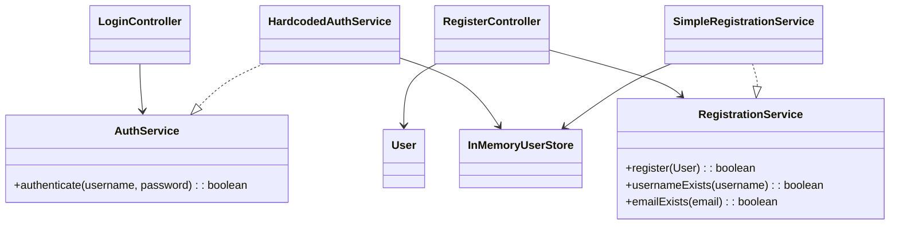

# CST-339 CLC Project — Week 3 Design Report
**Project:** Video Game Library (Spring Boot, Thymeleaf)  
**Role:** Business Logic Lead — Login & Registration (Dependency Injection)  
**Student:** James Pinto  
**Course:** CST-339 — Enterprise Applications Programming in Java  
**Team:** Group 5 (CLC)  
**Date:** September 07, 2025

---

## Cover Page: Tasks Completed (Business Logic Lead)
- Refactored Login and Registration flows to use Spring Beans & constructor-based DI.
- Introduced `AuthService` and `RegistrationService` interfaces with simple in-memory implementations.
- Integrated `InMemoryUserStore` as temporary persistence seam (Week 3: no DB required).
- Added Jakarta Validation to `User`; surfaced field/global errors in Thymeleaf templates.
- Switched to absolute routes: `GET/POST /login` and `GET /logout` for simpler navbar linking.
- Implemented session-based login state; logout clears session and redirects to `/login`.
- Updated navbar to toggle Login/Register vs. user dropdown + Logout based on session.
- Added success/error alerts to login page; page titles injected for layout.
- Wrote Javadoc and inline comments; conducted peer review and captured notes.

---

## Planning Documentation

### User Story & Acceptance Criteria
- **User Story:** As a visitor, I can register an account so that I can log in to the app.  
- **User Story:** As a user, I can log in with my username and password so I can access app features.  
- **Acceptance Criteria:**
  - Validation errors display under fields.
  - Bad credentials show a global error.
  - Successful registration redirects to `/login` (or shows success message).
  - Successful login redirects to `/` with a flash message.
  - Logout clears session.

### Task List (Week 3 scope)
1. Define service interfaces (`AuthService`, `RegistrationService`).
2. Provide simple implementations backed by `InMemoryUserStore`.
3. Refactor `LoginController` and `RegisterController` to use DI (constructor injection).
4. Add Jakarta Validation to `User` and wire Thymeleaf error rendering.
5. Adjust routes to absolute paths; update navbar and messages.
6. Manual tests + peer review; write Javadoc; prepare screencast.

### Scrum Artifacts (Summary)
- **Sprint Goal:** Deliver DI-based login/registration with validation and demo.
- **Daily Progress:** Interfaces → controllers → views/messages → tests → docs.
- **Definition of Done:** All acceptance criteria met; code reviewed; screencast recorded; doc updated; branch merged via PR.

---

## Design Documentation

### General Technical Approach
- **Presentation:** Thymeleaf with Bootstrap using a common layout; session-aware navbar and page titles.
- **Business Layer:** Authentication and registration behind interfaces (`AuthService`, `RegistrationService`), injected into controllers via constructor DI (Spring Core).
- **Persistence (Week 3):** `InMemoryUserStore` emulates a data source; actual DB integration is planned for Milestone 4.
- **Security (Week 3):** `HttpSession` attribute (`username`) marks logged-in state; `GET /logout` clears the session. Spring Security and password hashing are planned for later milestones.

### Key Technical Decisions
- **Constructor Injection** preferred over field injection for testability and immutability.
- **Interface-first Services** so controllers remain unchanged when swapping in DB-backed implementations.
- **Server-side Validation** with Jakarta Validation on `User`; clean Thymeleaf error surfacing.
- **Absolute Routes** (`/login`, `/logout`, `/register`) to simplify links and avoid prefix pitfalls.
- **Plain-text Passwords (Dev only)** for Week 3; hashing to be added with DB + Spring Security.

### Install / Configuration Instructions
1. Clone the repository
2. Run: `mvn spring-boot:run`
3. Open: `http://localhost:8080/`
4. Demo: Register a new user, then log in; or use a seeded account if present (e.g., `admin / Password`).
5. Logout via the navbar dropdown (`GET /logout`).

### Known Issues & Risks (Week 3)
- Passwords stored in memory and transmitted in plain text (development only).
- No authorization rules beyond basic session check; Spring Security deferred.
- In-memory data resets on application restart.
- No CSRF handling yet (using `GET /logout` for simplicity in Week 3).

### Sitemap Diagram (Week 3 scope)
```
/
├── GET /login (form), POST /login (authenticate)
├── GET /logout (clear session → redirect /login)
└── GET /register (form), POST /register (validate + save → redirect /login?registered=1)
```

### UI Diagrams (Wireframe Notes)
- **Login:** Title, success banner after registration, global error for bad creds, username/password fields, submit button.
- **Register:** First/Last/Email/Phone/Username/Password fields; field-level errors; success redirects to login.
- **Navbar:** Shows Login/Register when logged out; shows “Welcome, {username}” dropdown (Games, Logout) when logged in.

### ER Diagram & DDL Scripts
Week 3 does not require a database implementation. The Data/Domain Lead will provide a draft ERD and DDL for the Product model for Milestone 4.

### Class Diagrams (Controllers & Object Models)


---

## Review and Documentation

### Peer Code Review Notes
- Verified constructor DI (no field injection).
- Confirmed services behind interfaces; controllers have no direct `new` of service implementations.
- Checked validation annotations and Thymeleaf error rendering.
- Confirmed absolute routing and navbar session toggling work.
- Minor nit: added `StringTrimmerEditor` `@InitBinder` for cleaner validation.

### Javadoc & Inline Comments
Key classes and methods include Javadoc summaries and parameter/return tags where appropriate. Controllers outline GET/POST flows; services specify contract behavior; `InMemoryUserStore` documents expected case-insensitive lookups.

---

## Screencast & Repository

### Screencast URL
> _[Add your screencast link here]_

---

## Test Plan (Excerpt)
1. **Login / required:** Submitting empty form shows “Username and password are required.”
2. **Login / invalid:** Wrong password shows global “Invalid username or password.”
3. **Login / success:** Valid credentials redirect to `/`, shows flash “Welcome, {username}”.
4. **Register / validation:** Invalid email or short password surfaces field errors.
5. **Register / duplicates:** Existing username/email shows field errors.
6. **Register / success:** New user saved in memory; redirect to `/login?registered=1` shows success banner.
7. **Logout:** Clicking Logout clears session and redirects to `/login` with flash message.

---

## Appendix

### Key Routes
- `/login` (GET, POST), `/logout` (GET), `/register` (GET, POST)

### Key Classes (Business Logic Lead)
- `LoginController`, `RegisterController`
- `AuthService`, `RegistrationService`, `HardcodedAuthService`, `SimpleRegistrationService`
- `InMemoryUserStore`, `User`
