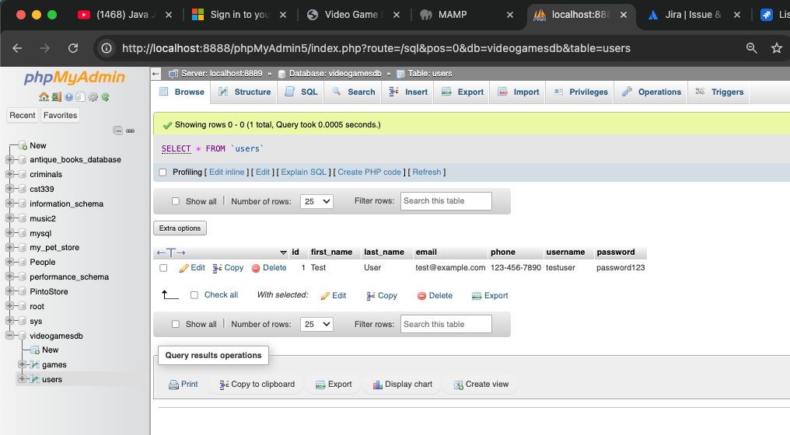
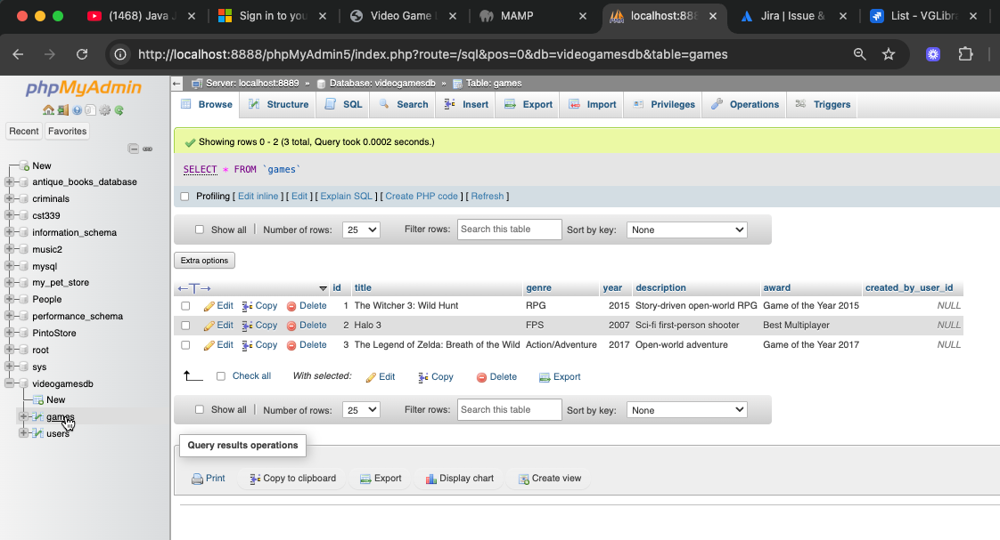
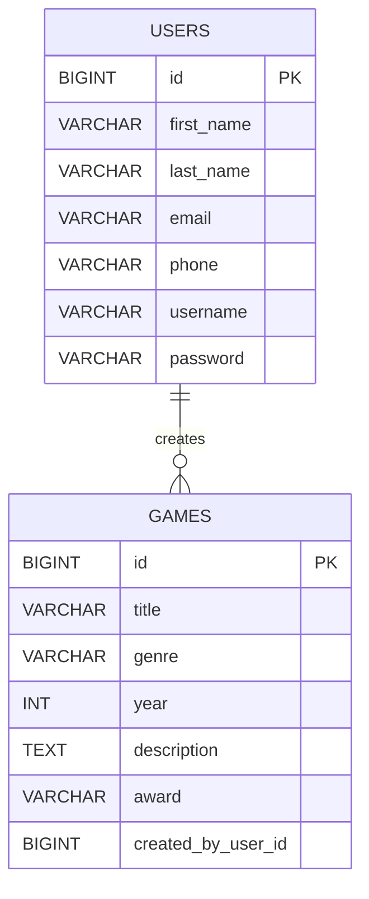

# CST-339 Programming in Java III  
## Project Status and Design Report  
**Milestone 4 – Refactoring with Spring Data JDBC and Database Integration**  

**Date:** 09/13/2025  
**Team:** Group 5 (Carlos Cortes, James Pinto, Justin Iaconis)  

---

## Cover Page  
### Tasks Completed in Milestone 4  
- Refactored **Login** and **Registration** modules to use Spring Data JDBC (Carlos).  
- Created and tested **users table** in MySQL with working persistence.  
- Confirmed login with seeded user (`testuser` / `password123`) authenticates against the database.  
- Added **games table** and seeded sample rows for testing.  
- Verified schema and data auto-initialization through Spring Boot (`schema.sql`, `data.sql`).  
- Application builds and runs as a JAR using Maven.  
- Updated **Design Report** with DDL scripts, ER diagram, and documentation.  

---

## Planning Documentation  
### Weekly Team Status Summary  
| User Story                                                                | Team Member | Hours Worked |  
|---------------------------------------------------------------------------|-------------|--------------|
| User Module Refactor (Login + Registration)                               | Carlos      | 10           |  
| Database scripts, ER diagram, documentation                               | James       | 8            |  
| Product Creation Module Refactor (Game entity, repo, service, controller) | Justin.     | 9            |


### Tools & Workflow  
- **GitHub** for version control.  
- **Jira** board for sprint/task tracking.  
- **Peer Review** through Git commits and group chat.  

---

## Design Documentation  

### General Technical Approach  
- Built with **Spring Boot** using an **N-Layer architecture** (Controller → Service → Repository → Database).  
- **Spring MVC + Thymeleaf + Bootstrap** for responsive UI.  
- **Spring Data JDBC** for persistence, with schema and seed data automatically initialized.  
- **MySQL** database running on port `8889`.  
- Database initialization controlled via `application.properties`:  

```properties
spring.application.name=cst-339_group-5
spring.datasource.url=jdbc:mysql://localhost:8889/videogamesdb
spring.datasource.username=root
spring.datasource.password=root
spring.datasource.driver-class-name=com.mysql.cj.jdbc.Driver
# Force Spring Boot to always run schema.sql and data.sql
spring.sql.init.mode=always
spring.sql.init.schema-locations=classpath:schema.sql
spring.sql.init.data-locations=classpath:data.sql
```  

### Key Technical Decisions  
- Use of **Spring Data JDBC Repositories** (instead of manual DAOs) to simplify persistence.  
- `schema.sql` + `data.sql` auto-run at startup for predictable DB state.  
- Seeding one default user ensures login is always testable.  
- Added constraints: `username` unique, optional FK from `games` → `users`.  

### DDL Scripts  
**schema.sql**  
```sql
CREATE TABLE IF NOT EXISTS users (
    id BIGINT AUTO_INCREMENT PRIMARY KEY,
    first_name VARCHAR(50) NOT NULL,
    last_name VARCHAR(50) NOT NULL,
    email VARCHAR(254) NOT NULL,
    phone VARCHAR(20) NOT NULL,
    username VARCHAR(30) NOT NULL UNIQUE,
    password VARCHAR(72) NOT NULL
);

CREATE TABLE IF NOT EXISTS games (
    id BIGINT AUTO_INCREMENT PRIMARY KEY,
    title VARCHAR(100) NOT NULL,
    genre VARCHAR(50) NOT NULL,
    year INT NOT NULL,
    description TEXT,
    award VARCHAR(100),
    created_by_user_id BIGINT,
    CONSTRAINT fk_games_user FOREIGN KEY (created_by_user_id) REFERENCES users(id)
);
```  

**data.sql**  
```sql
INSERT INTO users (first_name, last_name, email, phone, username, password)
SELECT 'Test', 'User', 'test@example.com', '123-456-7890', 'testuser', 'password123'
WHERE NOT EXISTS (SELECT 1 FROM users WHERE username = 'testuser');

INSERT INTO games (title, genre, year, description, award)
VALUES
('The Witcher 3: Wild Hunt', 'RPG', 2015, 'Story-driven open-world RPG', 'Game of the Year 2015'),
('Halo 3', 'FPS', 2007, 'Sci-fi first-person shooter', 'Best Multiplayer'),
('The Legend of Zelda: Breath of the Wild', 'Action/Adventure', 2017, 'Open-world adventure', 'Game of the Year 2017');
```  

### Database Verification (phpMyAdmin Screenshots)

Below are screenshots from phpMyAdmin confirming that the `users` and `games` tables 
were created successfully and seeded with data.

**Users Table**  


**Games Table**  



### ER Diagram  


### Known Issues & Risks  
- Password seeding currently uses **plaintext**; will eventually switch to **BCrypt hashes** when integrating Spring Security (Milestone 6). 

---

## Review and Documentation  
- **Code Reviews** performed by team through GitHub commits.  
- **JavaDoc** comments being added for entity classes, repositories, and services.  
- **Inline comments** in controllers and SQL scripts.  

---

## Deliverables  
- Updated Design Report (this markdown).  
- GitHub Repository: [Project Repo](https://github.com/JIaconisGCU/CST-339_Group-5#)  
- Screencast URL: *[to be added after recording]*  
