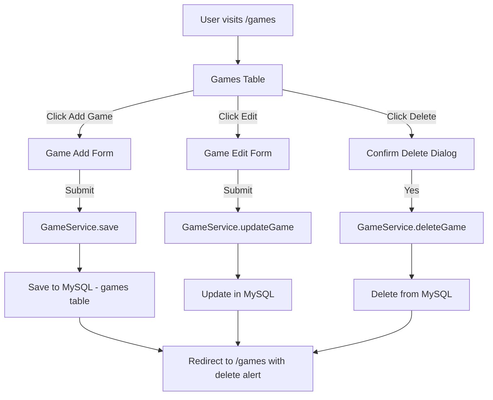
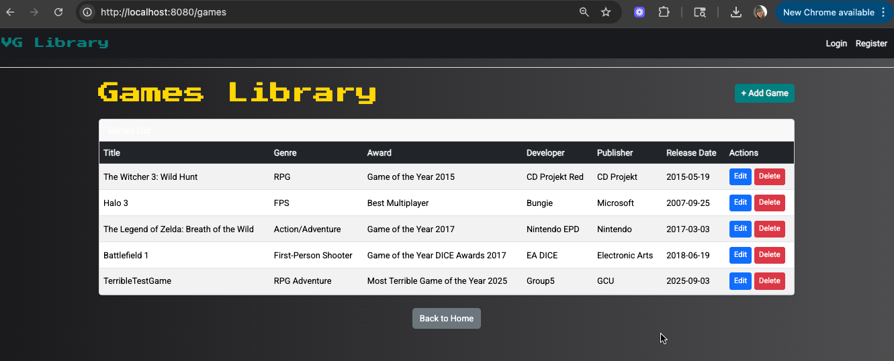
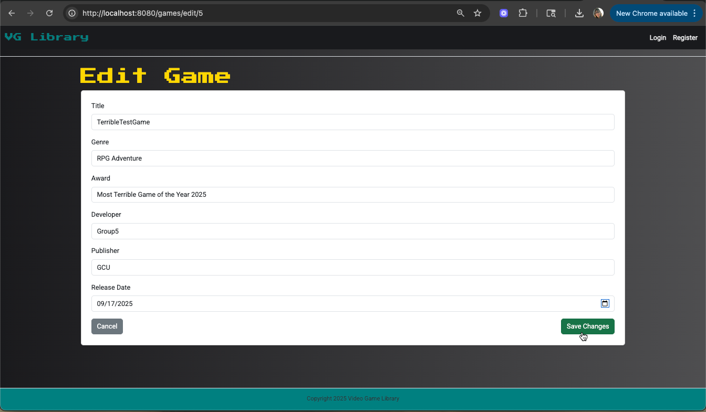
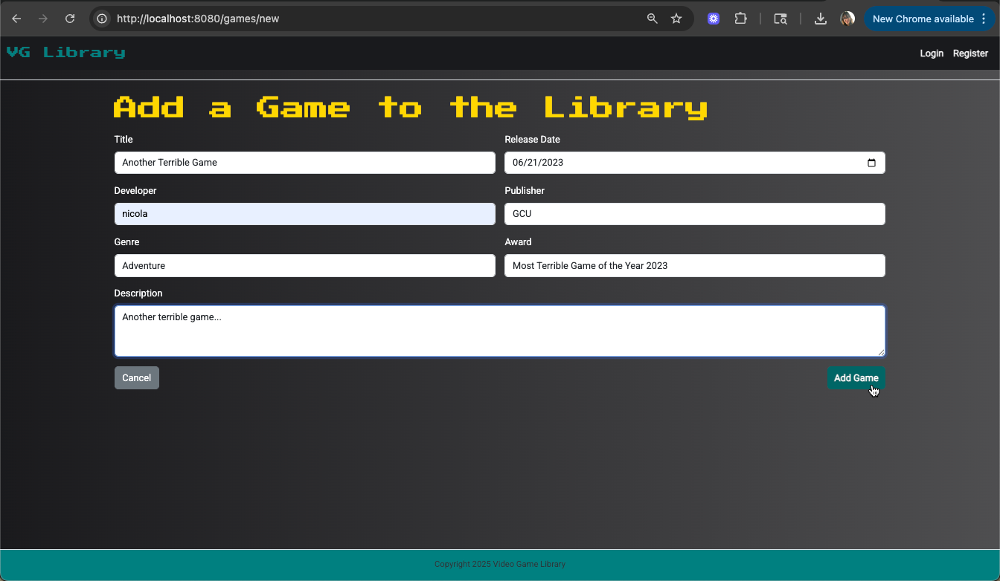
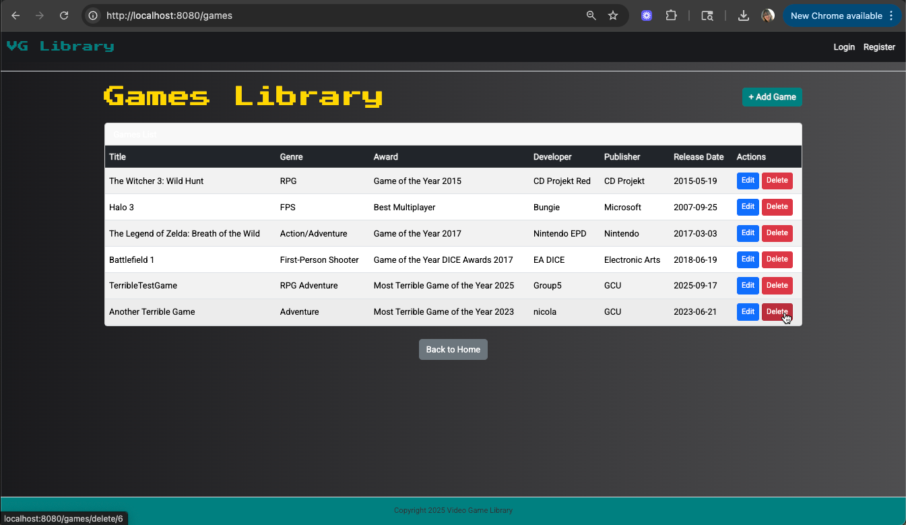
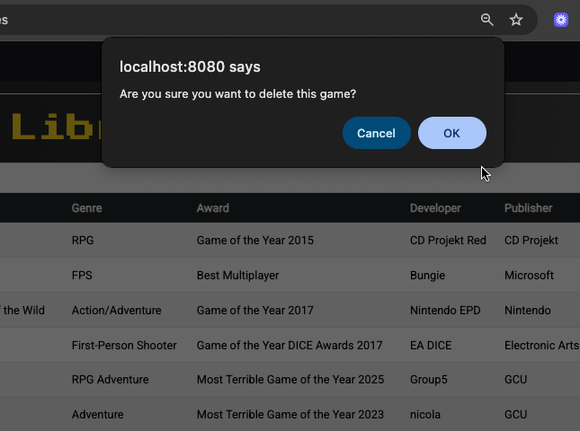
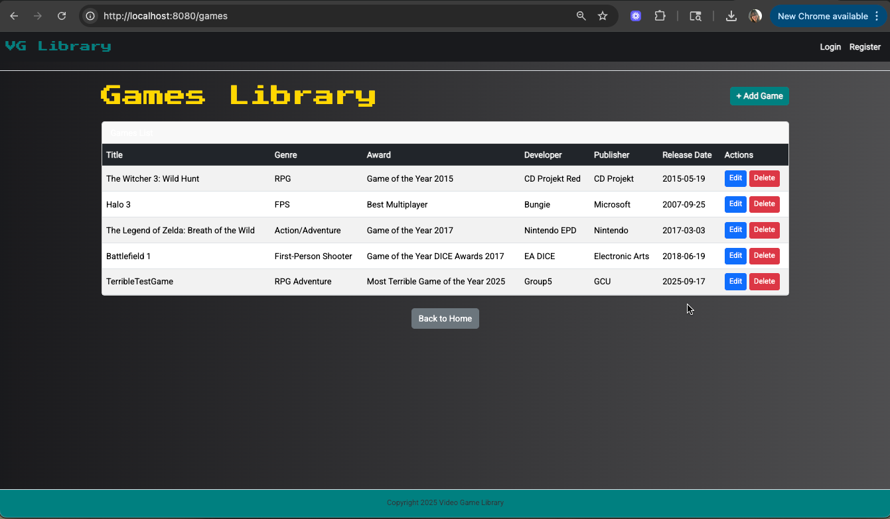

# CST-339 CLC Project – Milestone 5 
**Carlos Cortes Role 1: Presentation / UX Lead (assisting with Persistence Layer this Milestone)**

---

## Cover Page – Tasks Completed by Role 1
- Refactored **User module** (Login + Registration) to use **Spring Data JDBC** instead of in-memory services.  
- Added **`UserRepository`** (CrudRepository) and **`UserService`** for persistence.  
- Updated **`RegisterController`** and **`LoginController`** to use the new service.  
- Created and verified **`schema.sql`** for automatic table creation (`users` table).  
- Created **`data.sql`** with a safe test user for login validation.  
- Configured **`application.properties`** to connect to MySQL (`videogamesdb` on port 8889).  
- Fixed login redirect issue (now routes to `/` instead of `/home`).  
- Tested end-to-end: user registration saves to DB and login authenticates correctly.  
- **Milestone 5 Additions:**  
  - Expanded `games.html` to display games in a styled Bootstrap table with **Edit/Delete** buttons.  
  - Created new `game-edit-form.html` for updating existing games.  
  - Updated **GameAddController** with new methods for edit, update, and delete.  
  - Styled all buttons consistently (`btn-teal` for main actions, `btn-danger` for delete, `btn-secondary` for cancel).  
  - Verified full CRUD cycle: add → list → edit → update → delete.   

---

## Planning Documentation (Role 1 perspective)
- **Carlos (Role 1 – Presentation/UX, assisting Persistence)**  
  - Refactored **User module** to Spring Data JDBC  
  - Created `UserRepository` and `UserService`  
  - Updated controllers for DB  
  - Added and tested `schema.sql` and `data.sql` (users table)  
  - Fixed login redirect  
  - **Milestone 5**: Expanded `games.html`, created `game-edit-form.html`, styled buttons, and verified CRUD cycle  

- **Carlos+James (Role 2 – Business/Service Layer)**  
  - Refactored **Product Creation module** to Spring Data JDBC  
  - Created `Game` entity, `GameRepository`, and `GameService`  
  - Updated `GameAddController` to save new products  
  - Extended `schema.sql` with `games` table  
  - Added sample game row in `data.sql`  
  - **Milestone 5**: Added `getGameById`, `updateGame`, and `deleteGame` in `GameService`  

- **James Pinto (Role 3 – Database/Documentation)**  
  - Finalized `schema.sql` (users + games)  
  - Added safe insert test data in `data.sql`  
  - Created/updated **ER Diagram** (users + games)  
  - Provided **DDL scripts**  
  - Helped update Design Report (technical decisions, risks, diagrams)  
  - **Milestone 5**: Confirmed DB supports update/delete, updated design report with new wireframes  

- **Workflow**:  
  - Each teammate developed in local branch.  
  - All code merged to `development` branch on GitHub.  
  - Merge conflicts were resolved, prioritizing:  
    - Role 1 for layout/UI code.  
    - Role 2 & 3 for Registration/Login controllers. 

- **Peer review**: teammates reviewed layout changes and tested in browsers before merging.  

---

## General Technical Approach (Updated from Milestones 1–5)
- Application integrates with **MySQL** via **Spring Data JDBC**.  
- Entities (`User`, `Game`) annotated with `@Table` and `@Id`.  
- Repositories extend `CrudRepository` for CRUD operations.  
- Services (`UserService`, `GameService`) encapsulate business logic.  
- `schema.sql` and `data.sql` initialize database schema and test data.  
- **Milestone 4 Update**: Refactored Login/Registration for persistence.  
- **Milestone 5 Update**:  
  - Added **Display module** (`games.html` now lists all games in a Bootstrap table).  
  - Added **Update/Delete modules** (`game-edit-form.html`, controller and service methods for edit/update/delete).  
  - Verified end-to-end CRUD: add, view, edit, update, delete. 

---

## Key Technical Design Decisions
- Chose **Spring Data JDBC** for simplified persistence.  
- Removed in-memory services to avoid confusion.  
- Used safe `IF NOT EXISTS` in `schema.sql` to prevent errors.  
- Added safe inserts in `data.sql` to avoid duplicate rows.  
- Standardized button styling with **custom `btn-teal` class** for primary actions.  
- Ensured **confirmation dialog** for delete to reduce accidental removals.  

---

## Install / Configuration Instructions (Games module additions)
1. Ensure `GameRepository` extends `CrudRepository<Game, Long>`.  
2. Confirm `schema.sql` contains:  
   ```sql
   CREATE TABLE IF NOT EXISTS games (
       id BIGINT AUTO_INCREMENT PRIMARY KEY,
       title VARCHAR(100) NOT NULL,
       genre VARCHAR(50),
       award VARCHAR(100),
       developer VARCHAR(100) NOT NULL,
       publisher VARCHAR(100) NOT NULL,
       release_date DATE NOT NULL,
       description TEXT,
       created_by_user_id BIGINT
   );


## User Interface Diagram (Games CRUD Flow)



---
## Site Functionality Screenshots 

1. **Games List with Edit/Delete Buttons**  
   
The games.html page displays all games in a styled Bootstrap table, now with Edit and Delete buttons for each record.

2. **Edit Game Form**  
  
The edit form (game-edit-form.html) preloads the selected game’s details and allows updates with a Save Changes button.

3. **Add New Game Page**  
  
The Add Game form enables users to enter details for a new game, including title, developer, publisher, genre, award, description, and release date.

4. **Game Added to List**  
  
After submission, the new game is successfully added to the table and persists in the MySQL database.

5. **Delete Confirmation Prompt**  
  
Clicking Delete triggers a confirmation dialog to prevent accidental removal of a game.

6. **Game Deleted From List**  
  
After confirmation, the selected game is removed from the table and database, completing the full CRUD cycle.

---

## Known Issues & Risks
- Validation is basic; form rules need expansion (e.g., required fields, year constraints).
- No authentication/authorization yet — all users can edit/delete.
- Generic error handling (no custom error pages).
- Potential race conditions if multiple users edit simultaneously.

---

## Test Plan (Summary)
1. **List Games**: `/games` displays seeded games.
2. **Add Game**: New game appears in table and DB.
3. **Edit Game**: Form preloads data; updates persist to DB.
4. **Delete Game**: Record removed from table and DB.
5. **Redirects**: Post → Redirect → Get confirmed.

**Results**: All CRUD operations verified in browser + DB.

---
## Deliverables  
- Updated Design Report (this markdown).  
- GitHub Repository: [Project Repo](https://github.com/JIaconisGCU/CST-339_Group-5#)  
- Screencast URL: *[to be added after recording]*  
