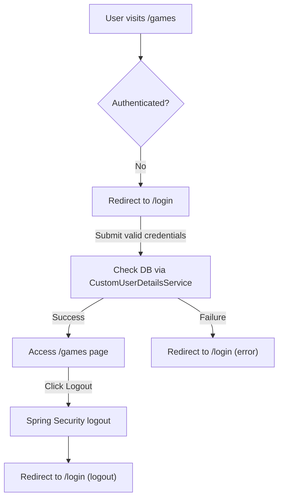
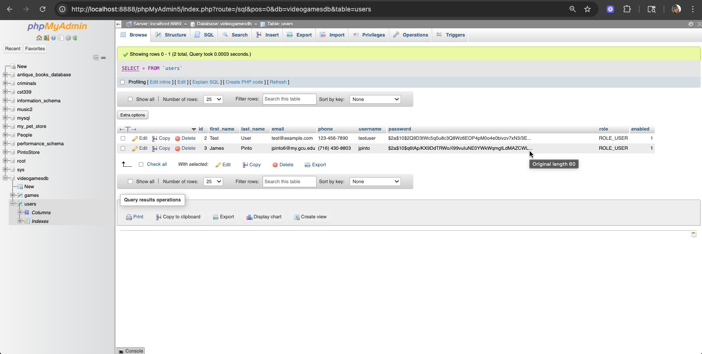

# CST-339 CLC Project – Milestone 6 

**Carlos Cortes Role 1: Presentation / UX Lead (assisting with Security Configuration this Milestone)**  

---

## Cover Page – Tasks Completed by Role 1  
- Added **Spring Security dependencies** (`spring-boot-starter-security` + `spring-security-crypto`) to `pom.xml`.  
- Created **`SecurityConfig.java`** to define authentication rules:  
  - Public pages → `/login`, `/register`, `/error`, `/css/**`, `/images/**`.  
  - All other routes secured by authentication.  
  - Configured **form-based login** (custom Thymeleaf `login.html`) and logout handling.  
  - Defined **`PasswordEncoder` bean (BCrypt)** for secure password storage.  
- Implemented **`CustomUserDetailsService.java`** to load users from the MySQL `users` table for authentication.  
- Updated **`RegisterController`** to hash passwords with BCrypt before saving to DB.  
- Updated **`login.html`** to support Spring Security login flow, error messages, and logout confirmation.  
- Verified that:  
  - Access to `/games` without login redirects to `/login`.  
  - Registration creates a DB record with a hashed password.  
  - Successful login grants access to secured pages.  
  - Logout redirects back to `/login?logout`.  

---

## Cover Page – Tasks Completed by Role 2  
- Refactored **`UserService`** to integrate with Spring Security’s `UserDetailsService`.  
- Added **`findByUsername()`** in `UserRepository` to support login queries.  
- Updated **`LoginController`** to remove custom `login()` call and rely on Spring Security authentication.  
- Verified **registration flow** creates hashed passwords in DB and allows login with Spring Security.  
- Assisted with **database updates** (`schema.sql` + `data.sql`) to ensure compatibility with BCrypt passwords.  
- Tested login/logout process end-to-end:  
  - Invalid credentials show error message.  
  - Successful login redirects to `/games`.  
  - Logout returns user to `/login?logout`.  

---

## Planning Documentation 
- **Carlos (Role 1 – Presentation/UX, assisting Security)**  
  - Added Spring Security dependencies.  
  - Built `SecurityConfig.java` with authentication rules, login/logout config, and BCrypt.  
  - Created `CustomUserDetailsService.java` to connect `UserRepository` with Spring Security.  
  - Updated `RegisterController` to hash passwords before saving.  
  - Updated `login.html` for Spring Security error/logout handling.  

- **James (Role 2 – Business/Service Layer)**  
  - Refactored `UserService` for compatibility with `CustomUserDetailsService`.  
  - Integrated repository method `findByUsername` for authentication.  
  - Updated controllers (`LoginController`) to delegate login to Spring Security.  
  - Helped update DB scripts for hashed password storage.  
  - Validated new login/register workflow with test users.  

- **Justin (Role 3 – Database/Documentation)**  
  - Updated **schema.sql** to ensure users table supports login.  
  - Helped confirm hashed passwords save correctly.  
  - Updated Design Report (technical approach, key decisions, risks).  
  - Added Security Design section (public vs. secure pages, authentication flow).   

- **Workflow**:  
  - Role 1 handled Spring Security configuration + UI updates.  
  - Role 2 aligned service layer and controller logic.
  - Role 3 focused on DB validation + documentation.  
  - Peer review confirmed authentication + redirects worked before merge.  

---

## General Technical Approach (Updated from Milestones 1–6)  
- Application integrates with **MySQL** via **Spring Data JDBC**.  
- Entities (`User`, `Game`) mapped to relational tables.  
- Repositories extend `CrudRepository` for CRUD operations.  
- Services encapsulate business logic.  
- **Milestone 6 Update**:  
  - Integrated **Spring Security** for login protection.  
  - All pages (except login, register, error) require authentication.  
  - Used **BCrypt hashing** for secure password storage.  
  - Built `CustomUserDetailsService` for DB-backed authentication.  
  - Updated `login.html` and `RegisterController` for Spring Security.  
  - `UserService` simplified to focus on persistence (delegating authentication to Spring Security).  
  - `UserRepository` extended with `findByUsername()` to query users by unique username.  
  - Controllers (Register, Login) updated to rely on Spring Security authentication instead of manual validation.  
  - Verified BCrypt integration by checking stored password hashes and successful login with raw password input.

---

## Key Technical Design Decisions  
- Chose **Spring Security form-based authentication** for simplicity and built-in security features.  
- Used **BCryptPasswordEncoder** to hash passwords before persistence.  
- Applied **role-based access (default USER role)** for future scalability.  
- Secured all endpoints except login, register, and error.  
- Updated login flow to use Spring Security parameters (`?error`, `?logout`, `?registered`).  
- Removed custom login method in `UserService` to avoid duplication with Spring Security.  
- Chose **`findByUsername`** as repository query to support Spring Security’s `UserDetailsService`.  
- Decided to register users through the application UI so all passwords are encoded properly.  
- Tested flow with multiple accounts (`jpinto`, `testuser2`) to ensure proper redirect and error handling.  

---

## Install / Configuration Instructions (Security Module Additions)  
1. Add dependencies to `pom.xml`:  
   ```xml
   <dependency>
       <groupId>org.springframework.boot</groupId>
       <artifactId>spring-boot-starter-security</artifactId>
   </dependency>
   <dependency>
       <groupId>org.springframework.security</groupId>
       <artifactId>spring-security-crypto</artifactId>
   </dependency>
2. Create SecurityConfig.java in com.gcu.cst339_group5.security.
3. Create CustomUserDetailsService.java in com.gcu.cst339_group5.security.
4. Update RegisterController to encode passwords with BCrypt before saving.
5. Update login.html to support Spring Security login/logout/error handling.
6. Run application → test login flow.

---

## User Interface Diagram (Login Security Flow)


---

## Functionality Screenshots 

1. **Database showing Password BCrypt Hashed after user registered**  
 

---
## Deliverables  
- Updated Design Report (this markdown).  
- GitHub Repository: [Project Repo](https://github.com/JIaconisGCU/CST-339_Group-5#)  
- Screencast URL: *[to be added after recording]*  
